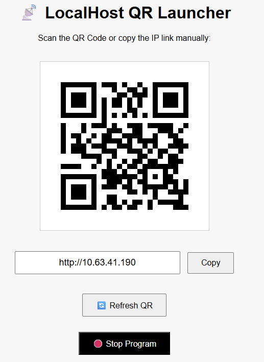

# 📡 LANShare

A lightweight desktop tool that detects your PC's local IPv4 address, generates a QR code for it, and opens a browser-based GUI to share the IP address with other devices on the same Wi-Fi network.

> Perfect for quickly sharing access to your local XAMPP server (or any LAN-accessible site) with mobile devices — no APKs or typing required.

---

## 🔧 Features

- ✅ Automatically detects your local IPv4 address
- ✅ Generates a scannable QR code for `http://<your-ip>:<port>`
- ✅ Simple GUI with:
  - IP display and copy button
  - QR code refresh button
  - Shutdown button to exit app
- ✅ Runs cleanly as a single `.exe` file (built with PyInstaller)
- ✅ Mobile devices can scan and access instantly

---

## 🖼 Screenshot



---

## 🚀 How to Use

1. **Double-click** the `gui_server.exe`
2. The app:
   - Launches your default browser to `http://127.0.0.1:5000`
   - Displays your local IP address and QR code
3. **Scan the QR** with your mobile device or **copy the IP**
4. Access your PC’s local services (e.g., XAMPP) from any device on the same Wi-Fi

---

## 📦 Build Instructions (For Developers)

Install dependencies:
```bash
pip install -r requirements.txt
```

Build the `.exe`:
```bash
pyinstaller --noconsole --onefile --add-data "templates;templates" lan_share.py
```

The compiled executable will be available inside the `dist/` folder.

---

## 📁 Project Structure

```
localhost_qr_launcher/
├── lan_share.py         # Main launcher logic
├── templates/
│   └── index.html        # GUI layout
├── README.md
```

---

## 🧠 Use Case Example

Want to test a website hosted on your XAMPP server from your phone?

- Start XAMPP
- Run this launcher
- Scan the QR with your mobile
- Open the site via `http://<your-ip>/yourproject`

No typing. No setup.

---

## 🛠 Built With

- [Flask](https://flask.palletsprojects.com/) — Lightweight web server
- [qrcode](https://pypi.org/project/qrcode/) — QR code generation
- [PyInstaller](https://www.pyinstaller.org/) — `.exe` packaging

---

## 📄 License

MIT License — free for personal or commercial use.

---

## 👨‍💻 Author

Developed by [@rdevz-ph](https://github.com/rdevz-ph)  
Project: **LANShare**
